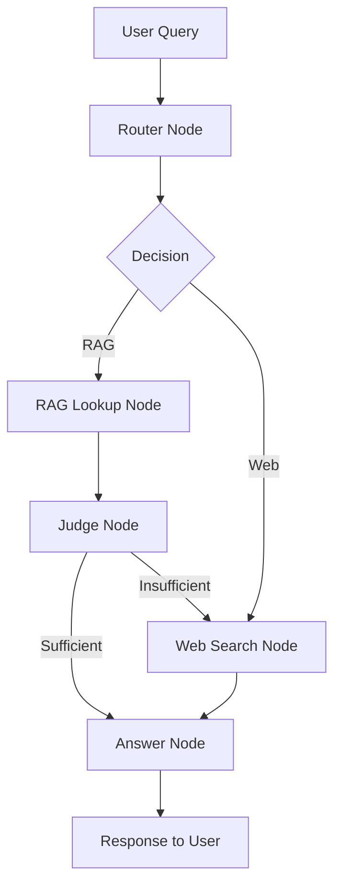

# 🛠️ Development Guide - MedAgent-Heart

## System Architecture

### Technology Stack

**Backend:**

- **FastAPI** - Modern, fast web framework for building APIs
- **LangGraph** - Agent workflow orchestration
- **LangChain** - LLM integration framework
- **Groq** - Fast LLM inference (llama-3.3-70b-versatile)
- **Pinecone** - Vector database for embeddings
- **Tavily** - Web search integration

**Frontend:**

- **Streamlit** - Interactive web UI framework
- **Custom CSS** - Tailwind-inspired color palette

### Agent Workflow



#### Node Descriptions

1. **Router Node** (`router_node`)

   - Analyzes query intent
   - Decides initial retrieval strategy
   - Can be overridden if web search is disabled

2. **RAG Lookup Node** (`rag_lookup_node`)

   - Queries Pinecone vector store
   - Retrieves relevant document chunks
   - Returns context for judgment

3. **Judge Node** (within RAG lookup)

   - Evaluates RAG results quality
   - Determines if information is sufficient
   - Routes to web search if needed

4. **Web Search Node** (`web_node`)

   - Performs Tavily web search
   - Retrieves latest online information
   - Respects web_search_enabled flag

5. **Answer Node** (`answer_node`)
   - Synthesizes final response
   - Uses gathered context (RAG/Web)
   - Generates user-friendly answer

## Project Structure Deep Dive

### Backend (`/backend`)

```
backend/
├── agent.py           # Core LangGraph agent logic
├── config.py          # Environment configuration
├── main.py            # FastAPI endpoints
├── vectorstore.py     # Pinecone operations
└── .env               # API keys (not in git)
```

**agent.py:**

- `RouteDecision` - Pydantic model for routing
- `RagJudge` - Pydantic model for judgment
- `router_node()` - Query routing logic
- `rag_lookup_node()` - Document retrieval
- `web_node()` - Web search
- `answer_node()` - Response generation
- `rag_agent` - Compiled StateGraph

**main.py:**

- `POST /chat/` - Main chat endpoint
- `POST /upload-document/` - Document upload
- `GET /health` - Health check
- `GET /` - API info

**vectorstore.py:**

- `init_pinecone()` - Initialize vector store
- `add_document_to_vectorstore()` - Index documents
- `search_vectorstore()` - Semantic search

### Frontend (`/frontend`)

```
frontend/
├── app.py                 # Main Streamlit app
├── backendApi.py          # Backend API client
├── config.py              # Frontend configuration
├── session_manager.py     # Session state management
└── ui_components.py       # UI components & styling
```

**app.py:**

- Main application logic
- Error handling
- Chat interface
- Footer rendering

**ui_components.py:**

- `apply_custom_css()` - Custom styling
- `display_header()` - Page header
- `render_document_upload_section()` - Upload UI
- `render_agent_settings_section()` - Settings UI
- `display_chat_history()` - Chat messages
- `display_trace_events()` - Workflow trace

**session_manager.py:**

- Session state initialization
- Welcome message
- Unique session IDs

## Development Setup

### 1. Clone and Install

```bash
git clone https://github.com/angad2803/MedAgent-Heart.git
cd MedAgent-Heart
conda create -n medagent python=3.11 -y
conda activate medagent
pip install -r requirements.txt
```

### 2. Environment Variables

```bash
# backend/.env
GROQ_API_KEY=gsk_xxxx
PINECONE_API_KEY=pcsk_xxxx
PINECONE_ENVIRONMENT=us-east-1
PINECONE_INDEX_NAME=langgraph-rag-index
TAVILY_API_KEY=tvly-xxxx
EMBED_MODEL=sentence-transformers/all-MiniLM-L6-v2
```

### 3. Development Mode

**Backend with auto-reload:**

```bash
cd backend
uvicorn main:app --reload --host 0.0.0.0 --port 8000
```

**Frontend with auto-reload:**

```bash
streamlit run frontend/app.py
```

## Adding Features

### Add New Agent Node

1. Define the node function in `backend/agent.py`:

```python
def my_custom_node(state: AgentState, config: RunnableConfig) -> AgentState:
    # Your logic here
    state["custom_data"] = "processed"
    return state
```

2. Add to StateGraph:

```python
workflow.add_node("my_node", my_custom_node)
workflow.add_edge("router", "my_node")
```

### Add New API Endpoint

In `backend/main.py`:

```python
@app.post("/my-endpoint/")
async def my_endpoint(request: MyRequest):
    # Your logic here
    return {"result": "success"}
```

### Modify UI Components

In `frontend/ui_components.py`:

```python
def my_custom_component():
    st.markdown("""
        <div style='...'>
            Custom content
        </div>
    """, unsafe_allow_html=True)
```

## Testing

### Unit Tests

```bash
# Test individual endpoints
python -m pytest tests/

# Quick functionality test
python quick_test.py

# Comprehensive test
python final_test.py
```

### Manual Testing

1. **Health Check:**

   ```bash
   curl http://localhost:8000/health
   ```

2. **Chat Test:**

   ```bash
   curl -X POST http://localhost:8000/chat/ \
     -H "Content-Type: application/json" \
     -d '{"session_id":"test","query":"test","enable_web_search":true}'
   ```

3. **Upload Test:**
   ```bash
   curl -X POST http://localhost:8000/upload-document/ \
     -F "file=@dataForRag/heart_dieasespdf.pdf"
   ```

## Debugging

### Backend Debugging

Add print statements in agent nodes:

```python
def router_node(state: AgentState, config: RunnableConfig) -> AgentState:
    print(f"DEBUG: Query = {query}")
    print(f"DEBUG: Web search enabled = {web_search_enabled}")
    # ... rest of code
```

Check FastAPI logs in terminal for errors.

### Frontend Debugging

Use Streamlit's built-in debugging:

```python
st.write("DEBUG:", st.session_state.messages)
```

Check browser console for JavaScript errors.

### Vector Store Debugging

```python
# In vectorstore.py
print(f"Index stats: {index.describe_index_stats()}")
print(f"Search results: {results}")
```

## Performance Optimization

### Backend

- Use async operations where possible
- Cache frequent queries
- Optimize vector search parameters
- Batch document uploads

### Frontend

- Use `@st.cache_data` for expensive operations
- Minimize reloads with session state
- Lazy load components

## Color Palette Reference

```python
COLORS = {
    "charcoal": {
        "950": "#101113",  # Darkest background
        "800": "#2f3137",  # Cards, containers
        "600": "#5e626e",  # Borders
        "400": "#9195a1",  # Muted text
    },
    "electric_aqua": {
        "500": "#00eaff",  # Primary accent
        "300": "#66f2ff",  # Headers
    },
    "burnt_peach": {
        "500": "#f73c08",  # Errors
    },
    "tuscan_sun": {
        "500": "#f7b708",  # Warnings
    },
}
```

## API Response Models

### Chat Response

```python
{
    "response": str,
    "trace_events": [
        {
            "step": int,
            "node_name": str,
            "description": str,
            "details": dict,
            "event_type": str
        }
    ]
}
```

### Upload Response

```python
{
    "message": str,
    "filename": str,
    "processed_chunks": int
}
```

## Common Issues

### Issue: Model decommissioned error

**Solution:** Update model in `backend/agent.py`:

```python
router_llm = ChatGroq(model="llama-3.3-70b-versatile", temperature=0)
```

### Issue: Pinecone index not found

**Solution:** Create index manually or let the app create it automatically

### Issue: Module import errors

**Solution:** Ensure all dependencies are installed:

```bash
pip install -r requirements.txt
```

## Contributing Guidelines

1. Fork the repository
2. Create a feature branch
3. Make your changes
4. Add tests
5. Update documentation
6. Submit pull request

### Code Style

- Follow PEP 8 for Python
- Use type hints
- Add docstrings
- Comment complex logic
- Keep functions focused

### Commit Messages

```
feat: add new feature
fix: bug fix
docs: documentation update
style: code formatting
refactor: code restructuring
test: add tests
```

## Deployment

### Docker (Coming Soon)

```dockerfile
FROM python:3.11-slim
WORKDIR /app
COPY requirements.txt .
RUN pip install -r requirements.txt
COPY . .
CMD ["uvicorn", "backend.main:app", "--host", "0.0.0.0"]
```

### Cloud Deployment

- **Backend:** Deploy to Railway, Render, or AWS
- **Frontend:** Deploy to Streamlit Cloud
- **Database:** Use managed Pinecone

## Resources

- [LangGraph Docs](https://langchain-ai.github.io/langgraph/)
- [FastAPI Docs](https://fastapi.tiangolo.com/)
- [Streamlit Docs](https://docs.streamlit.io/)
- [Groq API](https://console.groq.com/docs)
- [Pinecone Docs](https://docs.pinecone.io/)

---

Happy developing! 🚀
